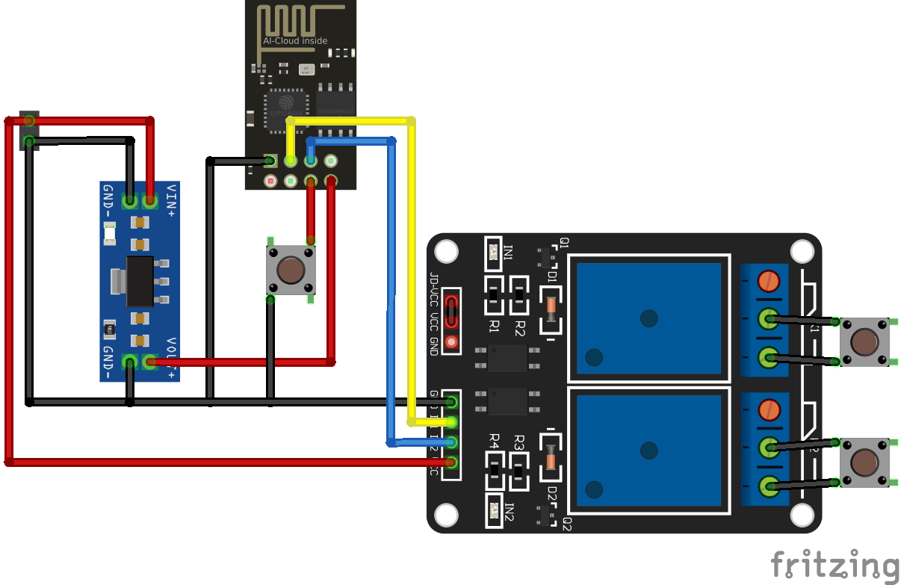
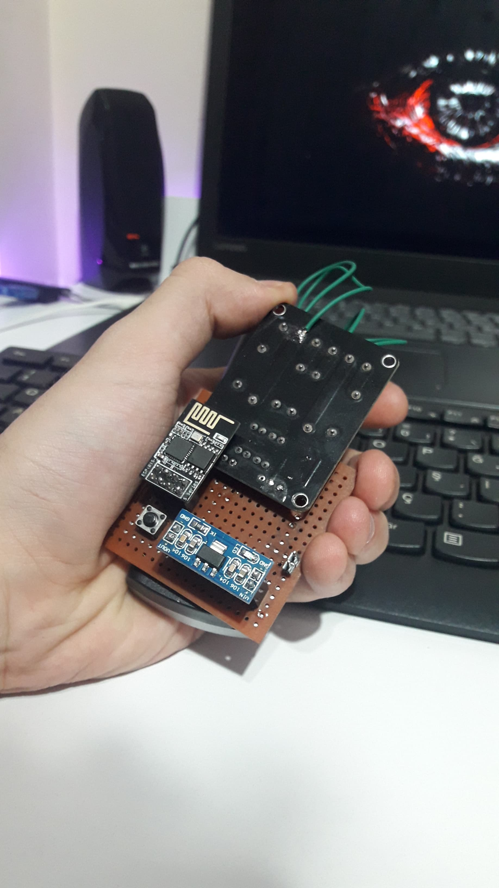
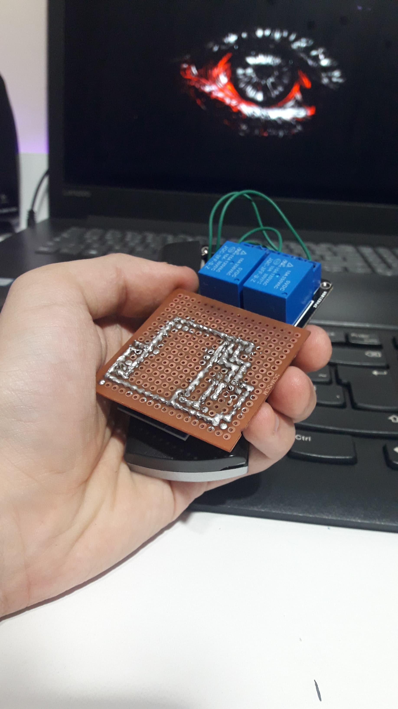
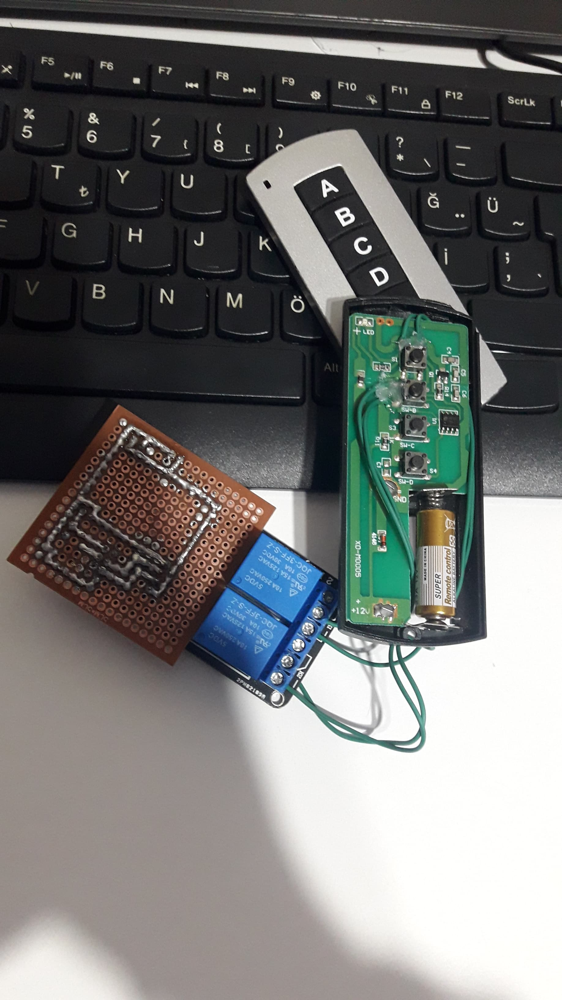

># Wiring diagram
>

### Materials;
- ESP8266 Wifi Serial Module
- 5v 2 Channel Relay Module
- Ams1117 3.3v Voltage Regulator Module
- 5x5 Perforated Pertinax
- 2x4 Pin Header Female
- 2x 1x2 Pin Header Female
- 4 Pin Tact Switch - 6x6x6.5mm

### The purpose of the project;
- I can control my room light thanks to the ESP8266 Wifi Serial Module!
- I was controlling my room lights with an IR remote control, it was very boring, I am sharing the solution I found with you! Actually, we are hacking the remote control a little, it is a project that can be personalized and used.

**The purpose of the code;**
- To control different lights connected to the relay.

**Things to note;**
- Since the relay is directly connected to the power supply, you need to connect the GND pin of the relay to the GND pin of the ESP.

**Don't know how to install the software in the module?**
- Don't worry [esp01_software](https://github.com/equlibrino/esp01_software)

># Circuit board - [Trial video](https://cdn.glitch.global/d03d2042-9967-4cf1-9859-fbce716a58fe/video.mp4?v=1712860379736) - [Web Site](image/web.jpg)
>

>  
>  
>  
>

